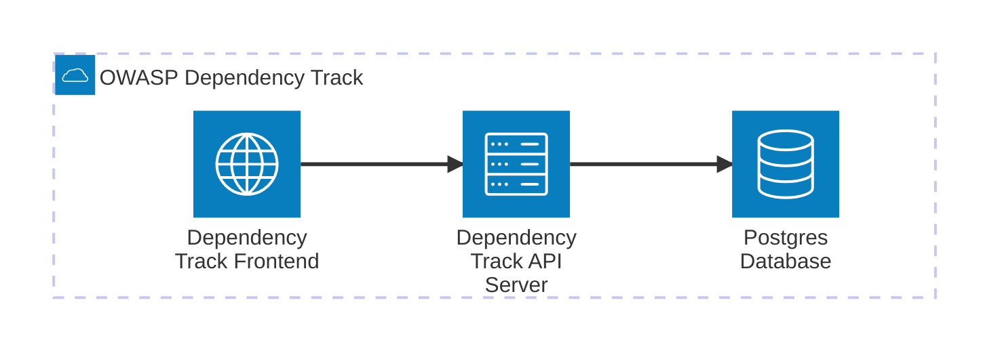

# Software Bill of Materials (SBOM)

[](https://github.com/rufer7/sbom-and-license-scanning-tryout/blob/main/LICENSE)
[](https://github.com/rufer7/sbom-and-license-scanning-tryout/actions/workflows/msft-sbom-tool.yml)
[](https://github.com/rufer7/sbom-and-license-scanning-tryout/actions/workflows/owasp-dep-scan.yml)
[](https://github.com/rufer7/sbom-and-license-scanning-tryout/actions/workflows/osv-scanner.yml)

## Vulnerability scanning and license compliance in the .NET ecosystem

by Marc Rufer & Raffael Nussbaumer
January 29, 2025

https://github.com/rufer7/sbom-and-license-scanning-tryout

<details>
<summary>What we are showing today</summary>

- What SBOM is and why you should consider using it
- How you create an SBOM for your .NET application
- How you can keep track of your SBOMS with OWASP Dependency Track and/or GitHub Advanced Security

</details>

---

<details>
<summary>What is an SBOM?</summary>

A Software Bill of Materials (SBOM) is a formal record containing the details and
**supply chain relationships** of various components used in building software.
These components, including libraries and modules, can be open source or proprietary,
free or paid, and the data can be widely available or access-restricted.

</details>

---

<details>
<summary>Standards and Formats</summary>

To ensure SBOMs are interoperable and easily exchangeable, standardized formats are used:

1. **SPDX** (Software Package Data Exchange): A standard supported by the Linux Foundation.
2. **CycloneDX**: A lightweight format specifically designed for security use cases.
3. **SWID Tags** (Software Identification Tags): An ISO standard for software identification.

</details>

---

<details>
<summary>Why Are SBOMs Important?</summary>

1. **Transparency**:

   - They provide a clear view of all software components, especially useful when using third-party or open-source dependencies.

2. **Security Management**:

   - SBOMs help identify vulnerabilities in components, allowing organizations to assess and mitigate risks such as zero-day vulnerabilities more effectively.

3. **Compliance**:
   - Documenting software licenses ensures companies meet licensing requirements and avoid legal complications.

</details>

---

<details>
<summary>SBOM and .NET</summary>

- [CycloneDX module for .NET](https://github.com/CycloneDX/cyclonedx-dotnet)
  ```powershell
  dotnet tool install --global CycloneDX
  dotnet CycloneDX YourSolution.sln -o /output/path
  ```
- [GitHub action to generate a CycloneDX SBOM for .NET](https://github.com/CycloneDX/gh-dotnet-generate-sbom)
  ```
  - name: Generate XML SBOM
    uses: CycloneDX/gh-dotnet-generate-sbom@v1
    with:
      path: ./CycloneDX.sln
      github-bearer-token: ${{ secrets.GITHUB_TOKEN }}
  ```

</details>

---

<details>
<summary>OWASP Dependency Track</summary>

OWASP Dependency-Track is a powerful tool for managing software dependencies and their vulnerabilities. It automates SBOM ingestion, scans for risks, tracks vulnerabilities, and ensures compliance, boosting supply chain security.

Can be easily operated on Azure and OIDC integration is also available. Terraform files for the setup can be found under `/deploy`.
Operation with recommended settings costs at least 100$/month.



</details>

---

<details>
<summary>OWASP dep-scan</summary>

</details>

---

<details>
<summary>OSV-Scanner</summary>

</details>

---

<details>
<summary>GitHub Advanced Security</summary>

</details>

---

<details>
<summary>Sources</summary>

- https://www.cisa.gov/

</details>
